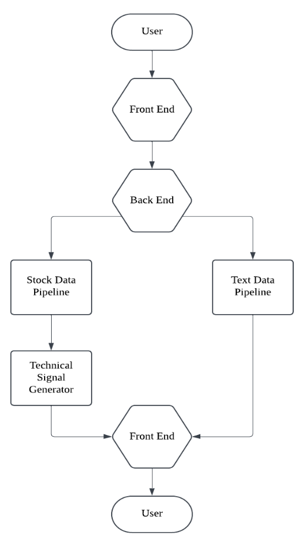

# LLM-Enhanced-Trading
A live sentiment analysis system leveraging LLMs like FinGPT for real-time financial news and social media sentiment extraction to optimize trading strategies.

# Project Overview

Financial markets are inherently unpredictable, driven by collective sentiment shaped by participants' moods and reactions. Capturing this sentiment in real-time from diverse sources like financial news and social media is critical, yet existing tools often fail to provide actionable insights.

This project bridges the gap using Large Language Models (LLMs) to synthesize complex language and extract nuanced real-time sentiment. Designed to support trading strategies, our system integrates sentiment analysis with predictive metrics, enhancing decision-making accuracy.

By combining LLM-based precision, multi-source data, and real-world testing, this end-to-end system delivers a robust tool for informed and reliable trading decisions.

# Benchmarking

The benchmarking of FinGPT, IBM Granite 3.0, and Meta LLaMA 3.1 was conducted using four key metrics: accuracy, precision, recall, and F1-score. These metrics comprehensively evaluate model performance by considering both the proportion of correct predictions and the balance between false positives and false negatives.

We used the Kaggle Financial Sentiment Analysis dataset for this exercise, as it features financial news headlines and their corresponding sentiment labels. This dataset is well-suited for assessing models in a trading context due to its domain-specific vocabulary and diverse sentiment expressions, capturing the complexities of financial language.

| Model             | Accuracy | Precision | Recall  | F1-Score |
|--------------------|----------|-----------|---------|----------|
| **FinGPT**         | 0.7462   | 0.7675    | 0.7642  | 0.7488   |
| **IBM Granite 3.0**| 0.5861   | 0.6942    | 0.5861  | 0.6207   |
| **Meta LLaMA 3.1** | 0.6565   | 0.6657    | 0.6565  | 0.6440   |


FinGPT demonstrated superior performance across all metrics, driven by its domain-specific fine-tuning using Low-Rank Adaptation (LoRA). LoRA specializes in optimizing only a subset of model parameters, introducing low-rank matrices to capture task-specific features. This technique ensures computational efficiency while enhancing the model's adaptability to financial jargon and sentiment patterns.

In comparison, IBM Granite 3.0 and Meta LLaMA 3.1 struggled due to their lack of targeted fine-tuning for financial contexts. While robust in general NLP tasks, these models failed to capture subtle sentiment shifts and financial nuances effectively.

FinGPT’s specialization and adaptability make it the most promising candidate for real-time decision-making in sentiment-driven trading strategies.


# Backtesting Sentiment Integration

Backtesting of the trading system was conducted using historical stock prices and sentiment data from Reddit (2022–2023). Two frameworks were evaluated:

1. **Baseline Framework**: Utilized traditional technical indicators without sentiment integration.
2. **Sentiment-Enhanced Framework**: Incorporated sentiment signals with technical indicators, dynamically adjusting trade sizes based on sentiment strength.
Key performance metrics such as Sharpe Ratio and Win Ratio were used to evaluate the effectiveness of sentiment integration.


### Backtesting Metrics

- **Sharpe Ratio**: The **Sharpe Ratio** measures risk-adjusted returns by evaluating the excess return per unit of volatility. A higher Sharpe Ratio indicates better risk-adjusted performance. 

- **Win Ratio**: The **Win Ratio** represents the percentage of profitable trades executed over the total number of trades. A higher Win Ratio indicates greater consistency in achieving profitable trades.  


### Backtesting Results and Comparison Table

Sentiment integration demonstrated significant improvements in trading performance across both the evaluated metrics:

- **Sharpe Ratio**: Sentiment integration significantly boosted risk-adjusted returns across all tickers.

  - TSLA's SMA strategy improved from **0.34 to 3.47**.
  - AAPL and AMZN also exhibited substantial positive shifts.

- **Win Ratio**: The proportion of profitable trades increased notably with sentiment integration.
  
  - TSLA’s SMA strategy win ratio rose from **32.2% to 57.0%**.
  - Similar improvements were observed in AAPL and AMZN for sentiment-driven strategies.


| **Tickers** | **Strat1 Sharpe** | **Strat1 Win Ratio** | **Strat2 Sharpe** | **Strat2 Win Ratio** | **Strat3 Sharpe** | **Strat3 Win Ratio** |
|-------------|--------------------|-----------------------|--------------------|-----------------------|--------------------|-----------------------|
| **Baseline**            |                    |                       |                    |                       |                    |                       |
| TSLA        | 0.34               | 32.2%                 | 0.15               | 52.3%                 | -1.58              | 70.7%                 |
| AAPL        | -4.03              | 29.9%                 | -0.97              | 49.5%                 | 1.20               | 78.0%                 |
| AMZN        | -2.75              | 30.1%                 | -0.85              | 49.2%                 | -1.05              | 78.5%                 |
| **With Sentiment**       |                    |                       |                    |                       |                    |                       |
| TSLA        | 3.47               | 57.0%                 | 2.37               | 51.4%                 | 1.79               | 64.3%                 |
| AAPL        | 2.13               | 54.9%                 | 1.58               | 50.9%                 | 1.61               | 72.1%                 |
| AMZN        | 3.14               | 64.3%                 | 2.32               | 52.0%                 | -1.03              | 65.1%                 |


### Key Insights 

1. **Enhanced Predictive Power**: Sentiment signals capture market dynamics and investor sentiment that traditional indicators often miss, particularly for volatile stocks like TSLA.
2. **Strategy Versatility**: Sentiment integration complements various trading strategies, significantly improving their robustness and effectiveness.
3. **Stock-Specific Sensitivity**: Sentiment-driven strategies work exceptionally well for sentiment-sensitive stocks like TSLA and AMZN, showcasing the model’s adaptability to specific market conditions.
4. **Practical Utility for Traders**: Sentiment-integrated strategies offer actionable insights, enhancing decision-making even when technical indicators produce ambiguous signals.

These findings demonstrate that integrating sentiment with technical indicators improves both risk-adjusted performance (Sharpe Ratio) and trade profitability consistency (Win Ratio). This approach reduces volatility and enables more reliable trading outcomes.

# System Workflow: Real-Time Sentiment-Driven Trading

The system processes real-time financial data, extracts sentiment, and generates actionable trading signals through a modular workflow. This includes user interaction, data collection, processing, signal generation, and visualization, ensuring scalability and efficiency.

### **System Workflow**

1. **User Input**:
   - Users select stock tickers and submit them via the dashboard.

2. **Data Collection**:
   - **Stock Data**: Fetches real-time prices and volumes via Finnhub's WebSocket API, aggregated into minute-level VWAP.
   - **Text Data**: Retrieves financial news (News API) and Reddit data (PRAW API), aligned chronologically for consistency.

3. **Data Processing**:
   - **Stock Data**: VWAP calculations to smooth short-term fluctuations.
   - **Text Data**: Sentiment analysis using FinGPT, providing positive/negative classification and confidence scores (logits).

4. **Signal Generation**:
   - Generates actionable **buy/sell/hold signals** for four trading strategies (SMA crossover, RSI, Stochastic Oscillator, Breakouts).
   - Sentiment scores are integrated with signals, enabling informed decision-making. **Users decide whether to execute trades.**

5. **Back-End Processing**:
   - FastAPI manages REST endpoints, with multi-threading for concurrent pipeline execution.

6. **Visualization**:
   - The live dashboard provides:
     - Real-time VWAP updates.
     - Sentiment summaries.
     - Trading signals for each strategy.
   - Users can log simulated trades for performance evaluation.
  
## System Flowchart



# Deployment Overview

The system was deployed the system using a production-grade setup, leveraging Docker for containerization and Kubernetes for orchestration. Below are the steps we took to ensure a seamless and scalable deployment:

1. **Containerization**:
   - The application is containerized using **Docker**, with dependencies and configurations defined in a `Dockerfile` for consistent environments.
   - Docker images are built and pushed to a container registry (e.g., **Google Container Registry (GCR)**).

2. **Kubernetes Orchestration**:
   - A **Kubernetes cluster** is configured on **Google Kubernetes Engine (GKE)** to handle orchestration and scalability.
   - Deployment specifications, including container images, resource limits, GPU allocations, and environment variables, are defined in **YAML files**.
   - Pods and services are deployed using `kubectl`, with monitoring through `kubectl get pods` and `kubectl logs`.

3. **Backend and API Setup**:
   - The **FastAPI** backend serves API endpoints for sentiment analysis and trading signal generation.
   - Real-time data is integrated using external APIs, such as **Cohere**, **Finnhub**, and **NewsAPI**.

4. **Dashboard Deployment**:
   - A real-time dashboard is deployed for user interaction, providing insights into stock sentiment, trading signals, and logs.

## Deployment Video Tutorial

A comprehensive video tutorial is included in this section to demonstrate the deployment process of the application. The video provides step-by-step guidance on setting up the Kubernetes cluster, building and pushing the Docker image, and deploying the application using the provided YAML files. Additionally, it highlights key aspects such as scaling with Horizontal Pod Autoscaling (HPA). This tutorial ensures users can understand the entire setup process.

[](https://youtu.be/MMO_Y8ms9kk)

# **How to run the application ?**

Follow these steps to set up and run the application:


1. **Specify the `.env` File**:
   Create a `.env` file in the project root directory with the following format:
   ```env
   REDDIT_CLIENT_SECRET=<your_reddit_client_secret>
   REDDIT_CLIENT_ID=<your_reddit_client_id>
   REDDIT_USER_AGENT=<your_reddit_user_agent>
   NEWS_API_KEY=<your_news_api_key>
   COHERE_KEY=<your_cohere_key>
   FINNHUB_TOKEN=<your_finnhub_token>
   HF_TOKEN=<your_hf_token>


2. **Create a Kubernetes cluster**
    - Set up a Kubernetes cluster on Google Kubernetes Engine (GKE).
    - Configure kubectl to access your cluster
      
      ```gcloud container clusters get-credentials <cluster-name>```


3. **Dockerize the Application**
   
    - Build and push the Docker image to your container registry.
      - Build the docker image

      ```docker build -t <your-registry>/fastapi-app:v10 .```

      - Push the docker image to your GCR

      ```docker push <your-registry>/fastapi-app:v10```


4. **Deploy the Application**

    - The deployment requires the following YAML files:

      - **deployment.yaml**: Defines the deployment, number of replicas, and resource limits.
      - **service.yaml**: Configures a load balancer to expose the application.
      - **hpa.yaml**: Sets up horizontal pod autoscaling to automatically scale the pods depending on the workload.
      - **gpu.yaml**: Configures GPU-based pods for advanced computing tasks. The default GPU type is set to nvidia-tesla-t4 but can be modified based on their requirements.

    - Apply these files to the cluster using `kubectl`:
  
      ```
      kubectl apply -f deployment.yaml
      kubectl apply -f service.yaml
      kubectl apply -f hpa.yaml
      kubectl apply -f gpu.yaml
      ```


5. **Access the Application**

    - Navigate to the provided external IP or domain to interact with the system via the live dashboard.


### Monitoring and Logs

Use the following Kubernetes commands to monitor and debug the deployment:

```
# View running pods
kubectl get pods

# View active services
kubectl get services

# View deployment details
kubectl get deployments

# Check logs for a specific pod
kubectl logs <pod-name>
```

## **Local Testing**

Follow these steps to set up and run the application locally:


1. **Specify the `.env` File**:
   - Create a `.env` file in the project root directory with the following format:
   
   ```env
   REDDIT_CLIENT_SECRET=<your_reddit_client_secret>
   REDDIT_CLIENT_ID=<your_reddit_client_id>
   REDDIT_USER_AGENT=<your_reddit_user_agent>
   NEWS_API_KEY=<your_news_api_key>
   COHERE_KEY=<your_cohere_key>
   FINNHUB_TOKEN=<your_finnhub_token>
   HF_TOKEN=<your_hf_token>
   ```


2. **Install the dependencies**:
   - Use the following command to install the required dependencies:
     ```pip install -r requirements.txt```
   

3. **Run the Application**:
    - Start the application by running:
      ```python main.py```


4. **Access the Application**:
    - Open your browser and navigate to:
      ```http://127.0.0.1:8000/```

    - Here, you can interact with the system via the live dashboard.

### NOTE: GPU Environment Required

Ensure that you run this application in an environment with GPU support, as the system uses FinGPT, which requires heavy computation for real-time sentiment analysis. A setup with a compatible NVIDIA GPU is recommended for smooth operation.

# Tutorial

A detailed video tutorial is provided to guide users on interpreting the stock dashboard and effectively utilizing its features for making informed trades. The tutorial walks users through the various components of the dashboard, explaining how to analyze stock sentiment, technical indicators, and actionable signals. Additionally, the video demonstrates real-world examples of a few trades, showcasing the step-by-step process of making trading decisions based on the insights provided by the system. This tutorial serves as a comprehensive resource to help users maximize the potential of the stock dashboard for their trading strategies.

[](https://youtu.be/6WdB-Rn9ieA)

